# PAC-MAN
- [English](#english)
- [Español](#español)

# English
# PAC-MAN - Back to the classics of the 80's
Project done for the subject of Human Machine Communication. It was proposed to develop a visual application in Java with Swing implementing a strategy game with a game board and several characters based on the design of a video game from the 80s.

  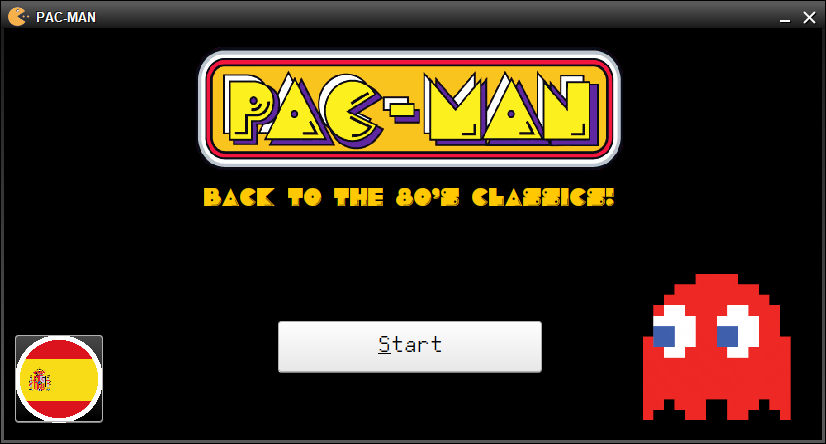
</>

## Table of Contents
- [PAC-MAN - Back to the classics of the 80's](#pac-man---back-to-the-classics-of-the-80s)
  - [Table of Contents](#table-of-contents)
  - [Introduction](#introduction)
  - [Project structure](#project-structure)
  - [Installation (Windows)](#installation-windows)
  - [Instructions](#instructions)
    - [How to play](#how-to-play)
      - [Valid ticket codes](#valid-ticket-codes)
    - [Scoring](#scoring)
    - [Prize selection](#prize-selection)
    - [End of the game](#end-of-game)
  - [Libraries and resources used](#libraries-and-resources-used)
  - [Author](#author)
  - [License](#license)

## Introduction
The context of this application is that a well-known chain of video game stores wants to reward its customers by offering them participation in a game based on the aesthetics of the characters of the console games of the 80s. Each store of the chain has installed several terminals where each customer has the possibility to play a game and, if he/she is lucky and skillful, win a prize depending on the points obtained during the game. Each customer who has made a purchase in a store will obtain a ticket with the store code, the ticket code and, if the amount is over 20 euros, will be eligible to play the game and win prizes according to the number of points the user has been able to obtain. When the user selects his prizes and confirms his selection, a file will be created with his ID, store code and the codes of each of the chosen prizes so that he can claim the prizes in the store.

This application is internationalized, so it has the option to change the language between Spanish and English, it contains sounds at the start of the application, at the beginning of the game, every time the characters are grouped each round and at the end of the game, and it also uses customized typographies adapted to the theme for the texts of the application.

## Installation (Windows)
To set up the development environment and run the project, follow these steps:

1. Clone this repository: `git clone https://github.com/coral2742/PAC-MAN.git`.
2. Open your preferred development environment.
3. Import the project into your environment.
4. Compile and run the `uo.cpm.module.Main` class to start the application.

## Instructions
Once the application is started, the main window provides the option to change the language between Spanish and English. Once you click on "Start", you will be prompted for a store and ticket code which will later be validated with the [valid-codes](#valid-ticket-codes) mentioned below.

### How to play

When you start the game, you will see two boards, among other elements. The large board is the game board on which 5 ghosts already appear. Below this board, there is another smaller board with 5 ghosts that the user must place strategically to win the game.

In order to place the next ghosts from the lower board on the game board, you must select one of the ghosts by clicking on it, and then click on one of the free positions on the upper game board. A free square on the game board is represented by a gray square. The other squares may be occupied by another ghost or because there is an invalid white hole in the game.

  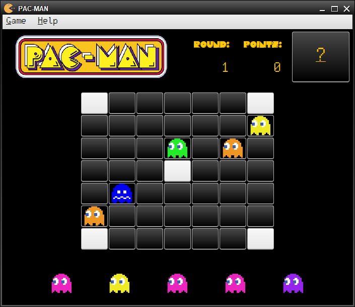
</>

#### Valid ticket codes
The user will be asked to enter the store code and the ticket number that can be found on the copy of the purchase ticket. Each ticket code is associated with a minimum amount of 20 euros to be eligible for the PACMAN game. Below are some examples of valid tickets.

Store code: `33429_01`.

|   Ticket Code   |  Amount  ($)  |     Validity    |
|-----------------|---------------|-----------------|
| 12314           | 10            | **Not** valid   |
| 24672           | 110,75        | Valid           |
| 36517           | 25,85         | Valid           |
| 16416           | 20            | Valid           |
| 68234           | 75            | Valid           |
| 49801           | 19,95         | **Not** valid   |

### Scoring
The player starts the game with 0 points and they will be added to the score counter once all 5 ghosts have been positioned and the round ends. If multiple groups of ghosts are grouped together in the same round, they will each be added together with the scores listed below:

- **Group of 3 ghosts**: increases 50 points.
- **Group of 4 ghosts**: increases 200 points.
- **Group of 5 ghosts**: increases 1000 points.
- **Group of 6 ghosts**: increase 5000 points.
- **Group of 7 ghosts**: increase 10000 points.

In a round, if 5 or more ghosts of the Cabecilla type are grouped together at once, the game will end and 20,000 points will be added.

  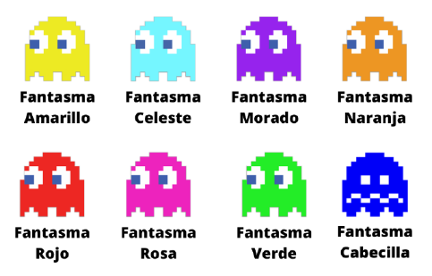
</>

### Prize selection
If the player finishes the game and wins, he/she will access the prize selection window. In this window, the player can filter the available prizes by category according to the type of prize (All, Accessories, Consoles or Video Games) or by points in ascending or descending order.

When selecting a prize, a panel is displayed on the right with details such as name, image, description and cost in points. The quantity can be chosen and there are buttons to add or remove units. If the available points are exceeded or too many units are selected, a warning message is displayed.

  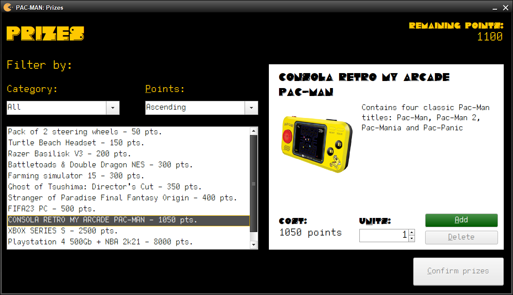
</>

To continue, at least one award must be selected. When confirming, the user is asked for his ID and is warned that he will lose the remaining points. A confirmation window is displayed with the selected prizes. If you are not satisfied, you can go back. After confirming, a file is generated with ID, store code and prize codes to claim them at the store. When finished, the application restarts for a new ticket registration.

  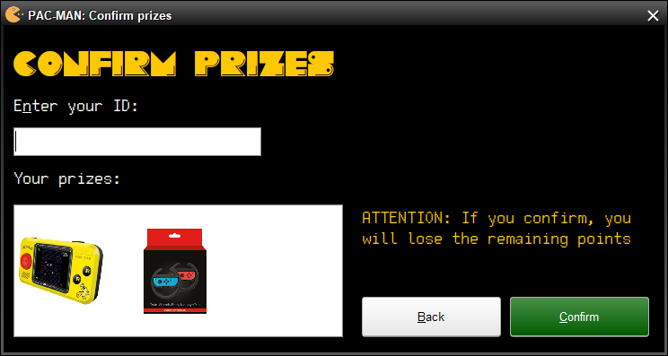
</>

### End of the game
The game can end for various reasons, which are described below:
- If the player reaches round number 10 and ends it with free holes on the game board, the game will end with the score obtained up to that moment.
- If the player manages to eliminate a group of 5 or more ghosts of the Header type at once, the game will end instantly adding 20000 points to the player.
- If the game board is completely empty, the game will end after the last ghosts have been grouped on the board and the player wins the game by being able to avoid the invasion.
- If all the squares are occupied by ghosts, the game ends and the player loses the game with 0 points because he was not able to avoid the invasion of the ghosts.

If the player finishes the game and wins, he will have the option to choose prizes according to the points he has obtained. A congratulatory window will appear informing that the game is over and that, in this case, he will be able to select his prizes.

Otherwise, a window will appear informing the player that the game is over with a confirmation button that will take him to the start window.

  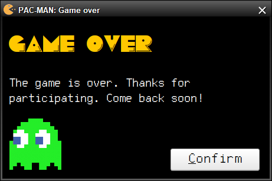
</>

## Libraries and resources used
https://www.guioteca.com/los-80/la-historia-del-inolvidable-pac-man-el-videojuego-mas-famoso-de-la-historia/
https://www.kindpng.com/
https://pnggrid.com/
https://www.schemecolor.com/pac-man-game-colors.php
https://www.dafont.com/es/
https://www.dafont.com/es/pacmania.font
https://www.dafont.com/es/pixeltype.font
http://www.sonidosmp3gratis.com/

## Author
[Coral Izquierdo Muñiz](https://github.com/coral2742)

You can contact me through my social networks:

<a>
    

## License
This project is distributed under the [MIT License](LICENSE). See the `LICENSE` file for more details.

# Español
# PAC-MAN - De vuelta a los clásicos de los 80
Proyecto realizado para la asignatura de Comunicación Persona Máquina. Se planteó desarrollar una aplicación visual en Java con Swing implementando un juego de estrategia con un tablero de juego y varios personajes basándose en el diseño de un videojuego de los años 80.

  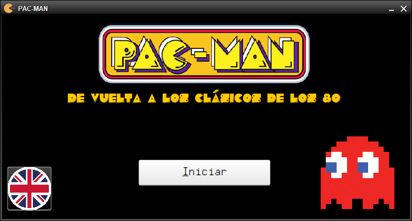
</>

## Tabla de contenidos
- [PAC-MAN - De vuelta a los clásicos de los 80](#pac-man---de-vuelta-a-los-clásicos-de-los-80)
  - [Tabla de contenidos](#tabla-de-contenidos)
  - [Introducción](#introducción)
  - [Estructura del proyecto](#estructura-del-proyecto)
  - [Instalación (Windows)](#instalación-windows)
  - [Instrucciones](#instrucciones)
    - [Cómo jugar](#cómo-jugar)
      - [Códigos de tickets válidos](#códigos-de-tickets-válidos)
    - [Puntuación](#puntuación)
    - [Selección de premios](#selección-de-premios)
    - [Fin de la partida](#fin-de-la-partida)
  - [Librerías y recursos utilizados](#librerías-y-recursos-utilizados)
  - [Autor](#autor)
  - [Licencia](#licencia)

## Introducción
El contexto de esta aplicación consiste en que una conocida cadena de tiendas de videojuegos quiere premiar a sus clientes ofreciéndoles la participación en un juego basado en la estética de los personajes de los juegos de consola de los años 80. Cada tienda de la cadena ha instalado varios terminales en los que cada cliente tiene la posibilidad de jugar una partida al juego y llevarse, si tiene suerte y destreza, algún premio dependiendo de los puntos obtenidos durante la partida. Cada cliente que haya realizado una compra en una tienda obtendrá un ticket con el código de la tienda, código del ticket y cuyo importe si es superior a 20 euros, podrá optar a jugar a este juego y podrá ganar premios en relación al número de puntos que el usuario ha sido capaz de conseguir. Cuando el usuario seleccione sus premios y confirme su selección, se creará un fichero con su DNI, código de la tienda y los códigos de cada uno de los premios elegidos para que pueda reclamar los premios en la tienda.

Esta aplicación está internacionalizada, por lo que tiene la opción de cambio de idioma entre español e inglés, contiene sonidos en el inicio de la aplicación, inicio de juego, cada vez que se agrupan los personajes cada ronda y al final de la partida, y además, se utilizan tipografías personalizadas adaptadas a la temática para los textos de la aplicación.

## Estructura del proyecto
El proyecto se estructura de la siguiente forma:

- `bin/`: Contiene archivos binarios generados durante la compilación.
- `files/`: Almacena archivos de datos necesarios para el proyecto.
- `font/`: Contiene fuentes tipográficas utilizadas en el proyecto.
- `help/`: Contiene recursos de ayuda y documentación.
- `sounds/`: Almacena archivos de sonido utilizados en el proyecto.
- `src/`: Contiene el código fuente del proyecto.
  - `img/`: Almacena imágenes utilizadas en la interfaz gráfica.
  - `rcs/`: Archivos de recursos adicionales para el idioma.
  - `uo/cpm/modulo/`: Paquete principal del proyecto.
    - `game/`: Clases relacionadas con la lógica del juego.
    - `model/`: Clases que definen el modelo de datos.
    - `service/`: Clases de servicios y utilidades.
    - `ui/`: Clases relacionadas con la interfaz de usuario.
    - `util/`: Clases que gestionan operaciones de lectura y escritura de ficheros.
  - `Main.java`: Punto de entrada principal del proyecto.

## Instalación (Windows)
Para configurar el entorno de desarrollo y ejecutar el proyecto, siga estos pasos:

1. Clone este repositorio: `git clone https://github.com/coral2742/PAC-MAN.git`.
2. Abra su entorno de desarrollo preferido.
3. Importe el proyecto en su entorno.
4. Compile y ejecute la clase `uo.cpm.modulo.Main` para iniciar la aplicación.

## Instrucciones
Una vez iniciada la aplicación, en la ventana principal se facilita la opción de cambio de idioma entre español e inglés. Una vez que se hace click en "Iniciar", se le pedirá un código de tienda y de ticket que posteriormente se validará con los [códigos válidos](#códigos-de-tickets-válidos) que se mencionan más adelante.

### Cómo jugar

Al empezar la partida, se verán dos tableros, entre otros elementos. El tablero grande es el tablero de juego sobre el que aparecen ya 5 fantasmas. Debajo de este tablero, aparece otro tablero más pequeño con 5 fantasmas que el usuario deberá de colocar estratégicamente para ganar la partida.

Para poder posicionar los siguientes fantasmas del tablero inferior sobre el tablero de juego, deberás seleccionar uno de los fantasmas haciendo click sobre el mismo, y seguido, hacer click en una de las posiciones libres del tablero de juego superior. Una casilla libre del tablero de juego, se representa con una casilla en gris. Las demás casillas, pueden estar ocupadas por otro fantasma, o bien, porque existe un hueco blanco inválido del juego.

  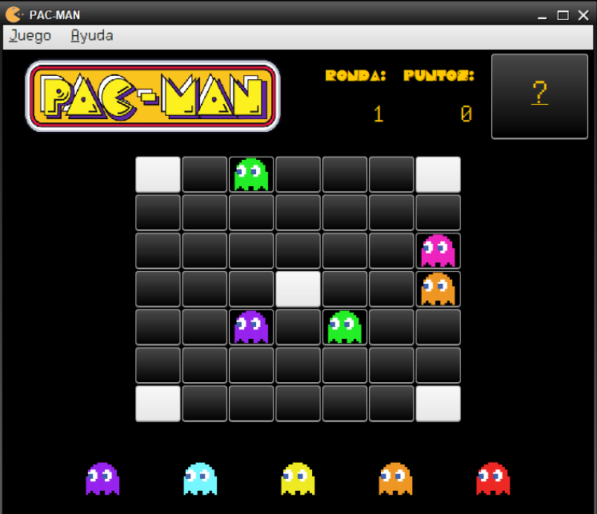
</>

#### Códigos de tickets válidos
Se le pedirá al usuario que introduzca el código de la tienda y el número de ticket que podrá encontrar en la copia del ticket de compra. Cada código de ticket, tiene asociado un importe cuyo mínimo para poder optar al juego PACMAN es de 20 euros. A continuación, se indican varios ejemplos de tickets válidos.

Código de tienda: `33429_01`

|  Código de ticket  |  Importe (€)  |     Validez     |
|--------------------|---------------|-----------------|
| 12314              | 10            | **No** válido   |
| 24672              | 110,75        | Válido          |
| 36517              | 25,85         | Válido          |
| 16416              | 20            | Válido          |
| 68234              | 75            | Válido          |
| 49801              | 19,95         | **No** válido   |

### Puntuación
El jugador comienza la partida con 0 puntos y se irán sumando al contador de la puntuación una vez que los 5 fantasmas se hayan posicionado y termine la ronda. Si se agrupan varios grupos de fantasmas en una misma ronda, se sumarán cada uno de ellos con las puntuaciones que se indican a continuación:

- **Grupo de 3 fantasmas**: incrementa 50 puntos.
- **Grupo de 4 fantasmas**: incrementa 200 puntos.
- **Grupo de 5 fantasmas**: incrementa 1000 puntos.
- **Grupo de 6 fantasmas**: incrementa 5000 puntos.
- **Grupo de 7 fantasmas**: incrementa 10000 puntos.

En una ronda, si se agrupan 5 o más fantasmas de tipo Cabecilla de golpe, finalizará la partida y se añadirán 20000 puntos.

  
</>

### Selección de premios
Si el jugador finaliza la partida y gana, accederá a la ventana de selección de premios. En esta ventana, el jugador podrá filtrar los premios disponibles por categoría según el tipo de premio (Todos, Accesorios, Consolas o Videojuegos) o por puntos de forma ascendente o descendente.

Al seleccionar un premio, se muestra un panel a la derecha con detalles como nombre, imagen, descripción y coste en puntos. Se puede elegir la cantidad y hay botones para añadir o eliminar unidades. Si se superan los puntos disponibles o se seleccionan demasiadas unidades, se muestra un mensaje de advertencia.

  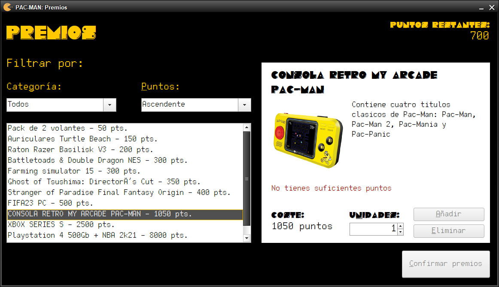
</>

Para continuar, se debe elegir al menos un premio. Al confirmar, se pide al usuario su DNI y se le advierte que perderá los puntos restantes. Se muestra una ventana de confirmación con los premios seleccionados. Si no está satisfecho, puede volver atrás. Después de confirmar, se genera un archivo con DNI, código de tienda y códigos de los premios para reclamarlos en la tienda. Al finalizar, la aplicación se reinicia para un nuevo registro de ticket.

  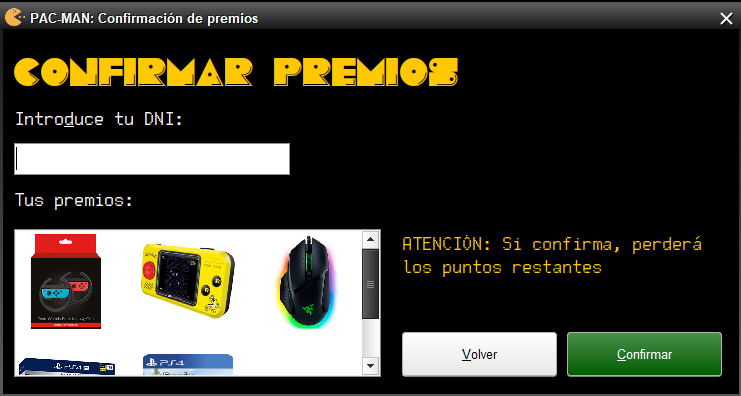
</>

### Fin de la partida
La partida puede finalizar por diversos motivos que se expresan a continuación:
- Si el jugador alcanza la ronda número 10 y la finaliza con huecos libres sobre el tablero de juego, finalizará la partida con la puntuación obtenida hasta ese momento.
- Si el jugador consigue eliminar un grupo de 5 o más fantasmas de tipo Cabecilla de golpe, la partida finalizará instantáneamente sumándose 20000 puntos al jugador.
- Si el tablero de juego queda completamente vacío, la partida finalizará después de haber agrupado los últimos fantasmas en el tablero y el jugador gana la partida al haber podido evitar la invasión.
- Si todas las casillas están ocupadas por fantasmas, la partida finalizará y el jugador perderá la partida con 0 puntos al no haber sido capaz de evitar la invasión de los fantasmas.

Si el jugador finaliza la partida y gana, tendrá la opción de elegir premios según los puntos que haya obtenido. Aparecerá una ventana de felicitación informando de que la partida ha finalizado y que, en este caso, podrá seleccionar sus premios.

En caso contrario, aparecerá una ventana informando al jugador de que la partida ha finalizado con un botón de confirmación que le llevará a la ventana de inicio.

  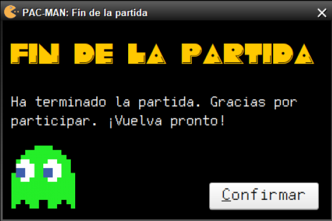
</>

## Librerías y recursos utilizados
https://www.guioteca.com/los-80/la-historia-del-inolvidable-pac-man-el-videojuego-mas-famoso-de-la-historia/
https://www.kindpng.com/
https://pnggrid.com/
https://www.schemecolor.com/pac-man-game-colors.php
https://www.dafont.com/es/
https://www.dafont.com/es/pacmania.font
https://www.dafont.com/es/pixeltype.font
http://www.sonidosmp3gratis.com/

## Autor
[Coral Izquierdo Muñiz](https://github.com/coral2742)

Podéis contactar conmigo a través de mis redes sociales:

<a>
    

## Licencia
Este proyecto se distribuye bajo la [Licencia MIT](LICENSE). Consulta el archivo `LICENSE` para obtener más detalles.