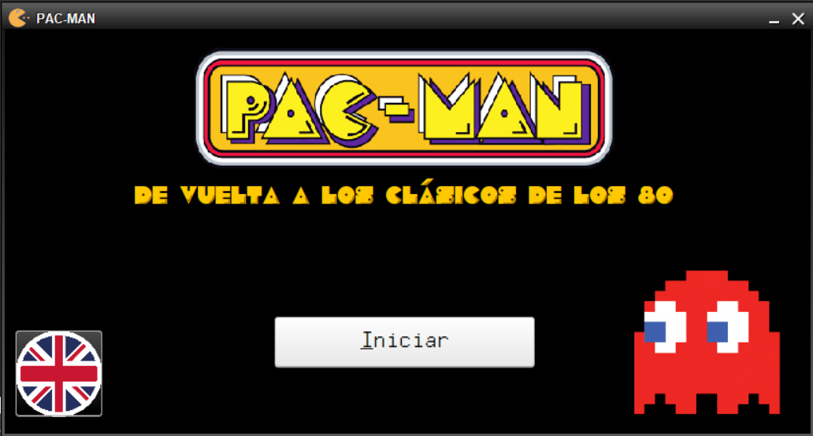

# PAC-MAN - De vuelta a los clásicos de los 80
Proyecto realizado para la asignatura de Comunicación Persona Máquina. Se planteó desarrollar una aplicación visual implementando un juego de estrategia con un tablero de juego y varios personajes basándose en el diseño de un videojuego de los años 80.

## Tabla de contenidos

- [Introducción](#PACMAN)
- [Instalación](#Instalación-(Windows))
- [Instrucciones](#Instrucciones)
    - [Cómo jugar](#Cómo-jugar)
    - [Tickets válidos](#Códigos-de-tickets-válidos)
    - [Puntuación](#Puntuación)
    - [Selección de premios](#Selección-de-premios)
    - [Fin de la partida](#Fin-de-la-partida)
- [Librerías y recursos utilizados](#Librerías-y-recursos)
- [Autor](#Autor)
- [Licencia](#Licencia)

## 1. Introducción

## Instalación (Windows)
En el apartado de [Releases](https://github.com/coral2742/PAC-MAN/releases) se ha subido un instalador creado con InstallAnyWhere con la primera versión [v1.0.0](https://github.com/coral2742/PAC-MAN/releases/tag/v1.0.0) de PAC-MAN.

- Descargar el archivo .exe
- Doble click en `PAC-MAN installer.exe` y seguir el instalador
- Una vez que se instale, se creará un acceso directo a la aplicación

## Instrucciones
Una vez instalada la aplicación, en la ventana principal se facilita la opción de cambio de idioma entre español e inglés. Una vez que se hace click en "Iniciar", se le pedirá un código de tienda y de ticket que posteriormente se validará con los [códigos válidos](#códigos-de-tickets-válidos) que se mencionan más adelante.

### Cómo jugar

Al empezar la partida, se verán dos tableros, entre otros elementos. El tablero grande es el tablero de juego sobre el que aparecen ya 5 fantasmas. Debajo de este tablero, aparece otro tablero más pequeño con 5 fantasmas que el usuario deberá de colocar estratégicamente para ganar la partida.

Para poder posicionar los siguientes fantasmas del tablero inferior sobre el tablero de juego, deberás seleccionar uno de los fantasmas haciendo click sobre el mismo, y seguido, hacer click en una de las posiciones libres del tablero de juego superior. Una casilla libre del tablero de juego, se representa con una casilla en gris. Las demás casillas, pueden estar ocupadas por otro fantasma, o bien, porque existe un hueco blanco inválido del juego.

## Códigos de tickets válidos
Se le pedirá al usuario que introduzca el código de la tienda y el número de ticket que podrá encontrar en la copia del ticket de compra. A continuación, se indican varios ejemplos de tickets válidos.

### Ejemplos de tickets válidos
Se pedirá un código de tienda y un código de ticket. Cada código de ticket, tiene asociado un importe cuyo mínimo para poder optar al juego PACMAN es de 20 euros.

Código de tienda: `33429_01`

Códigos de ticket con importes:
- `12314`
    - 10 euros (No válido)
- `24672`
    - 110,75 euros (Válido)
- `36517`
    - 25,85 euros (Válido)
- `16416`
    - 20 euros (Válido)
- `68234`
    - 75 euros (Válido)
- `49801`
    - 19,95 euros (No válido)

### Puntuación

### Selección de premios

### Fin de la partida

## Librerías y recursos utilizados

## Autor

## Licencia